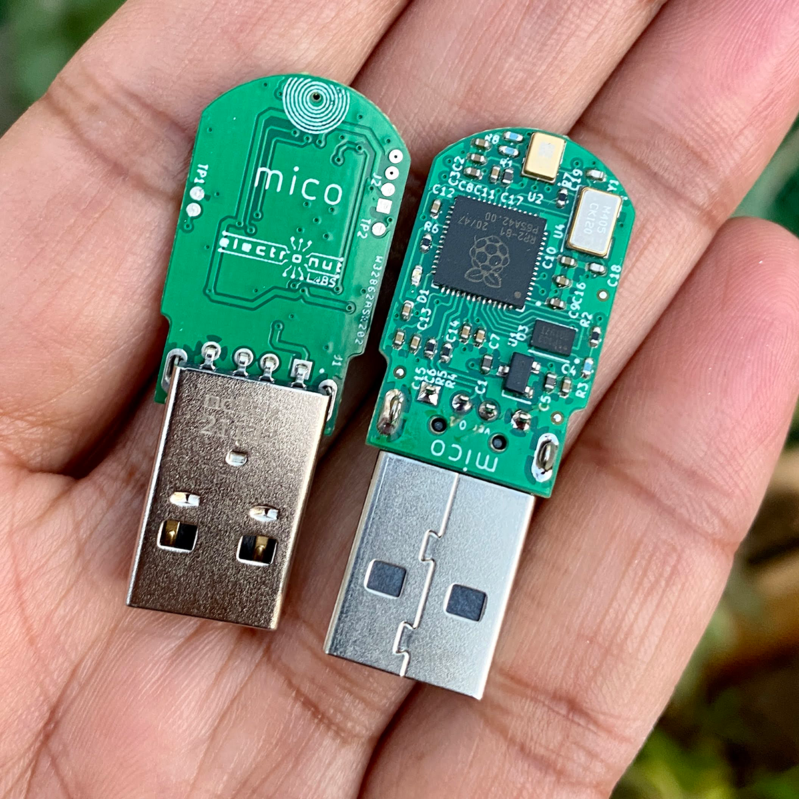

# Mico

Mico is an Open Source PDM to USB microphone based on the Raspberry PI RP2040. 

You can read more about the design of Mico here:

https://electronut.in/mico/

## Firmware

In the *firmware/* folder you will find the following UF2 files you can drag 
and drop on to Mico after you trigger the USB bootloader:

| **Firmware**| **Function**|
|----|----|
|pio_blinky.uf2 | Just blinks the LED |
|usb_microphone.uf2 | USB microphone |
|usb_microphone_blink.uf2 | USB microphone with LED blink|

## LICENSE

My part of the software for Mico is released under the MIT Licence.

Hardware design files are licensed as:

 This work is licensed under a <a rel="license" href="http://creativecommons.org/licenses/by-nc-sa/4.0/">Creative Commons Attribution-NonCommercial-ShareAlike 4.0 International License</a>.

I am currently working on manufacturing Mico. Please feel free to build Mico for personal use. If you want to manufacture Mico for commercial use, please get in touch with me for licensing. 

